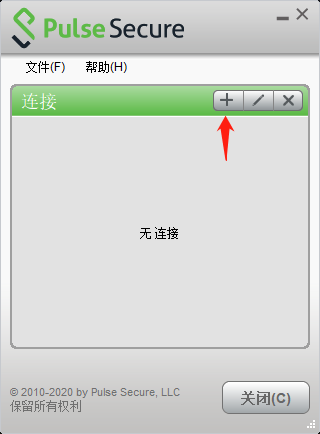
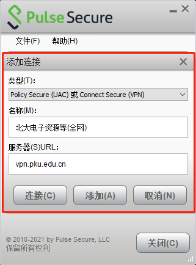
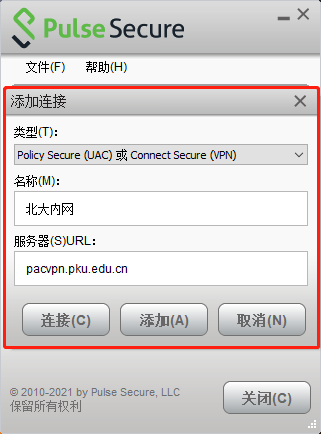
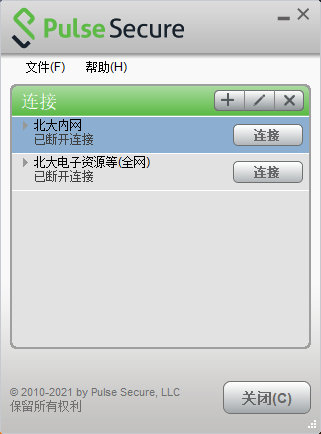
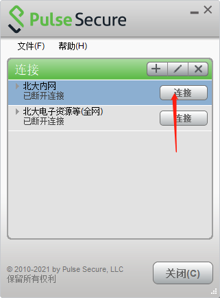
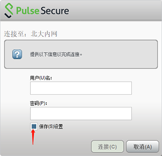
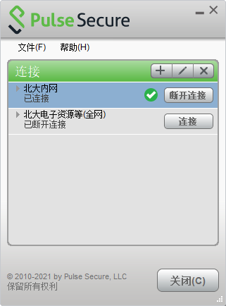

# VPN服务

为方便北京大学校园网用户在校外（家中、出差或国外）访问校园网资源，计算中心提供了[VPN服务](https://vpn.pku.edu.cn/)，可安全地接入校园网，如同在校内一样方便地访问学校全部的内网资源与服务（如校内门户、电子期刊数据资源等）。

*   [相关制度与规定](#1)
*   [使用及安装配置说明](#2)
*   [常见问题](#3)

*   [安装、配置、账户问题](#4)
*   [故障排查流程](#5)
*   [常见故障](#6)
*   [链路选择](#7)

## **相关制度与规定：**

1\. [《关于远程访问北京大学校园网电子资源的通告》](https://its.pku.edu.cn/service_1_vpn_announce20130620.jsp)（2013年06月20日）

2\. VPN使用校园网账户认证，与校本部校内门户账户一致；但有校内门户账号的，并不默认有校园网账户。

　　1) 教职工和在校生：默认已开通校园网账号，可以使用VPN，无需缴费。

　　2) 新生：一般在8月15日前后，需先登录门户激活账号、修改初始密码，然后校园网账号才能启用、使用VPN，无需缴费。

　　3) 公用账号：需申请开通VPN权限，并缴纳当月网费。申请流程：校内门户-办事大厅-IT服务-公用账号申请VPN权限。

　　4) 校友账户：若账户欠费，无法使用VPN，需先缴纳费用（20元/月)，提供账户及手持身份证件的照片，发邮件到its@pku.edu.cn，待管理员确认后，恢复VPN功能。

3\. 北大内网资源使用规定

　　1) 教职工、本科生、研究生、进修教师、特聘/访问学者、公用账号等：可访问全部学校资源（如电子期刊数据资源库，正版软件平台等）。

　　2) 校友：仅可访问部分内网资源，不含北大电子期刊数据库、图书馆论文系统、BBS及正版软件平台；不提供远程接入校园网IPv6。

## **使用及安装配置说明：**

VPN系统提供两种使用方式，全业务模式和北大内网模式。

　　1)．全业务模式（全网）:

　　能以校园网IP访问互联网资源及北大所有内网资源，包括检索和下载学校电子期刊资源等。

　　2)．北大内网模式（内网）:

　　专供校园内网业务系统的访问，比如办公系统，门户等，其它非校内业务由用户本地网直接访问。

**VPN服务安装配置说明**：

**提示：VPN使用中出现问题，请参考[“VPN常见问题”](https://its.pku.edu.cn/service_1_vpn.jsp)排查解决。若咨询客服请把排查过程、结果及账号发送至its@pku.edu.cn。**

### 一、**下载安装VPN客户端：**

#### A. **Windows系统**

1) 基于X86/X64处理器的Windows 10和11系统

　a) 新版本 [ps-pulse-win-22.7r1.0](./software/ps-pulse-win-22.7r1.0-b28369-64bit-installer.msi)

　b) 旧版本 [ps-pulse-win64-9.1r13.1](./software/ps-pulse-win64-9.1r13.1.msi)

2) 基于X86/X64处理器的Windows7及之前版本 --->[pulse-win64-5.3r4.0（64位）](./software/pulse-win64-5.3r4.0.msi)、[pulse-win32-5.3r4.0.msi（32位）](./software/pulse-win32-5.3r4.0.msi)。

3) 基于ARM处理器的 Windows系统

　a)新版本[ps-pulse-win-22.7r1.0-b28369-ARM64bit-installer.msi](./software/ps-pulse-win-22.7r1.0-b28369-ARM64bit-installer.msi)

　b) 旧版本 [ps-pulse-win-9.1r14.0-ARM64bitinstaller.msi](./software/ps-pulse-win-9.1r14.0-ARM64bitinstaller.msi)

#### B. **MAC OS系统**

1) macOS Sequoia 15.3 或 M3芯片系列 --->[ps-pulse-mac-22.8r1.dmg](./software/ps-pulse-mac-22.8r1.dmg)

2) macOS Sonoma 14.4及以上 --->[ps-pulse-mac-22.7r3.dmg](./software/ps-pulse-mac-22.7r3-b30227-installer.dmg)

3) macOS Sonoma 14以上 --->[ps-pulse-mac-22.7r1.0.dmg](./software/ps-pulse-mac-22.7r1.0.dmg)

4) macOS Ventura 13以上 --->[ps-pulse-mac-22.6r1.0](./software/ps-pulse-mac-22.6r1.0-b26825-installer.dmg)

5) macOS Monterey 12 及之下 --->[ps-pulse-mac-9.1r15.4](./software/ps-pulse-mac-9.1r15.2-b17113-installer.dmg)

若安装时系统提示“无法打开安装包，此软件需要更新”等信息，请进系统偏好-安全与隐私-通用（一般），选择允许任意来源的App安装，然后再重新安装。

macOS早期版本 --->[JunosPulse.dmg](./software/JunosPulse.dmg)

#### C. **Linux系统**

1)[ps-pulse-22.7r1.0-b28369-package.pkg](./software/ps-pulse-22.7r1.0-b28369-package.pkg)

2)[ps-pulse-linux-22.8r2.deb](./software/ps-pulse-linux-22.8r2-b33497-64bit-installer.deb)

若安装过程中系统提示需要libwebkit2gtk-4.0-37库，请参考[https://github.com/bambulab/BambuStudio/issues/3973#issuecomment-2085476683](https://github.com/bambulab/BambuStudio/issues/3973#issuecomment-2085476683)解决。

3)[<ps-pulse-linux-22.7r1.0-b28369-64bit-installer.rpm](./software/ps-pulse-linux-22.7r1.0-b28369-64bit-installer.rpm)

4)[<ps-pulse-linux-rhel7-22.7r1.0-b28369.rpm](./software/ps-pulse-linux-rhel7-22.7r1.0-b28369.rpm)

D. **苹果IOS系统**，在AppStore搜索并安装Ivanti Secure Access Client的App，并在App首页的url填写vpn.pku.edu.cn或pacvpn.pku.edu.cn。

E. **安卓系统**，请在应用宝搜索安装Ivanti Secure Access Client或Pulse Secure的App或点击下载安装（[22.4.1版本](./software/IvantiSecureAccessClient-22.4.1.apk)、[9.8版本](./software/pulse-secure9.8.apk)、[9.5版本](./software/net.pulsesecure-9.5.apk)、[7.2.1版本](./software/Pulse_Secure_v7.2.1.apk)、[5.0.3版本](./software/JunosPulse_5.0.3.44997.apk)）

### 二、**配置VPN服务器：**

系统提供两种使用方式，全业务和北大内网模式，本指南对二者都进行了配置，用户可根据每次的业务需求，通过选择不同的登录入口实现不同模式的切换。若只有一种业务需求，只选对应的一种配置即可。

A．全业务模式（全网）:

以校园网IP访问互联网资源，可检索和下载学校图书馆电子资源。

B．北大内网模式（内网）:

专供校园内网业务系统的访问，其它资源由用户本地网直接访问。

**配置步骤：**

下述配置步骤以WINDOWS系统为例，其它系统配置类似。

1\. 打开程序 “开始－>Pulse Secure－>Pulse Secure”，鼠标点图示中的”+”。

  

2\. 在新弹出的窗口中，填写下图示中的配置内容后，点“添加（A）”按钮。

1) 全业务模式（全网）: vpn.pku.edu.cn

  

2) 北大内网模式：pacvpn.pku.edu.cn

  

两种模式都添加后的结果：

  

### 三、**登录VPN**

1\. 根据需求，选择对应的VPN入口登录。

如访问“北大内网”，点“连接”按钮。

  

2\. 在弹出窗口输入用户名/密码。

若为个人电脑，选中“保持设置”选项，后续登录无需再输入密码。

  

3\. 登录成功。

已接入北大内网，打开浏览器或其它应用程序访问内网系统。

  

4\. 退出VPN系统。

点击上图的“断开连接”即可退出。

## **常见问题:**

一、安装、配置、账户问题

1\. 无法连接到统一网络

VPN客户端的后台进程没有运行，通常为系统内的安全软件、管家软件或其它VPN软件相冲突（比如翻墙软件）导致，须完全卸载这类软件后使用。

2\. 无法安装或安装回退

对MAC OS系统，检查版本的兼容性，且需在系统偏好设置中选择"允许任意来源的App安装”；对Windows系统，重点排查安全软件或其它VPN软件。

3\. 登录提示用户名/密码错

请检查是否开通了校园网账号或密码是否有误，多次认证失败后，系统会拒绝新的登录，请于30分钟后再试。

4\. 手机端安装首次使用时，在弹出的窗口输入URL“vpn.pku.edu.cn"，认证方式选择密码。

5\. 其它无法安装问题

VPN客户端经过专业测试可在正常系统安装使用。若无法安装，请卸载系统内的安全软件或其它VPN软件再试；若仍无法安装，请更新升级系统或重做您的操作系统。

二、故障排查流程

**提示： 若咨询客服，请务必先按如下流程进行排查，并把排查过程、结果及账号发送至its@pku.edu.cn，以供分析定位具体原因。**

1\. 链路排查

故障主机分别连本地WI-FI和手机4/5G流量做个人热点的网络，登录VPN。

1). 若连热点故障消失，则为本地WI-FI链路原因，参考"四、链路选择"解决。

2). 若两种接入方式故障仍存，为故障主机自身系统问题，继续下一步。

2\. 故障主机自身系统问题的佐证

使用手机、PAD或非故障主机等其它设备，连本地WI-FI，登录VPN。若故障消失，则故障主机自身系统的问题被证实，请参考如下的“三、常见故障"试着解决。

3\. 服务器端故障

若1和2流程测试均有故障，存在以下可能性：

1). 服务器系统故障，概率极低，只是理论上的，若为系统维护会发通知。

2). 服务器端链路故障，VPN有多条链路可达，可参考"四、链路选择"解决。

三、常见故障

彻底解决方案：如下列办法仍无法解决您的故障，请重装主机操作系统。

故障1：无法访问知网、电子期刊或个别网站

1). 请确认VPN登录成功：访问[https://its.pku.edu.cn/](https://its.pku.edu.cn)显示“您正通过VPN访问校内资源”或无需登录即可访问校内门户[https://portal.pku.edu.cn/](https://portal.pku.edu.cn)。

2). 检查系统内不能有翻墙或其它SOCKS代理软件，若有，需完全卸载而不是简单停用。

3). VPN系统不会限制用户访问范围，试着关闭浏览器重新打开网站。

若问题仍存，知网或电子资源问题请联系图书馆，网站请联系网站负责人或检查本地浏览器问题。

故障2：无法设置虚拟适配器

1). 卸载系统的安全软件（WINDOWS自带安全组件和北大提供的ESET防病毒除外），如注册表修改软件、各类软件管家、安全卫士等。

2). 若系统有其它VPN（含翻墙软件，各类socks代理）软件，请完全卸载。

故障3：保护连接、一直等待连接或时断时连

1). 若用户长期休眠不关机，请删除旧链接重新配置，注意不是卸载客户端重装。

2). 若系统有其它VPN（包括翻墙软件如clashX，各类socks代理）软件，请完全卸载。

3). 切换到其它链路，参考"四、链路选择"解决。

故障4：连上VPN本地无线网显示“无internet连接"；远程桌面或SSH速度慢、抖动

VPN链路质量差所致，远程桌面、SSH等应用实时性要求更高，可参考"四、链路选择"解决。

故障5：只有连接北大VPN后才能上网。

重置本地DNS域名解析的配置，并建议完全卸载系统内的安全管理软件，否则故障会复现。

故障6：无法连接或网络错误

打开客户端，新建配置（比如，名称为test，服务器URL: vpnc.pku.edu.cn）进行连接，若不弹出用户名/密码认证框，说明客户端找不到本地网络或无法解析VPN服务器地址，请检查或重置本地网络配置，例如修改DNS为自动获取。

四、链路选择

1\. 安装时为缺省配置，系统自动选择链路及服务器地址，用户也可自选如下配置而切换到特定链路。

缺省配置：vpn.pku.edu.cn（全网）、pacvpn.pku.edu.cn（内网）

1) 教育网链路: vpnc.pku.edu.cn（全网）、pacvpnc.pku.edu.cn（内网）

2) 电信链路: vpnt.pku.edu.cn（全网）、pacvpnt.pku.edu.cn（内网）

3) 联通链路: vpnu.pku.edu.cn（全网）、pacvpnu.pku.edu.cn（内网）

请注意，若选择不同链路均无改善，故障在本地WI-FI网络的接入端，请咨询本地运营商。

2\. 链路质量检测

断开VPN，在Windows系统打开DOS窗口， 分别ping不同链路VPN地址（如“ping vpn.pku.edu.cn -t”），无数据丢包、延时稳定、延时短为最优链路。