# 登录说明

## 我的统一身份认证用户名是什么?

教职工请使用工号，学生使用学号。

## 我的登录密码是什么?

新生和新入职教职工（8月12日后入校或入职）点击登录页面“首次访问请激活”，激活过程中绑定手机、设置个人登录密码，激活步骤详见“账号激活操作说明”。  

已有数字北语账号，登陆密码不变。为保障您的账号信息安全，系统将进行密码强度检测，不符合安全要求时，请根据系统弹窗完成密码修改，

## 我如何修改密码?

修改密码有两种方式：

第一种： 登录“数字平台”，依次点击【右上角头像】—【个人中心】—【账号安全】—【更换密码】，进行密码修改。

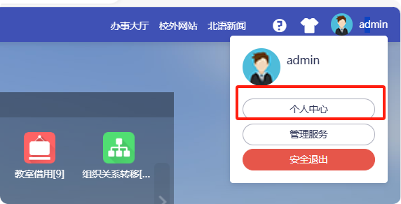

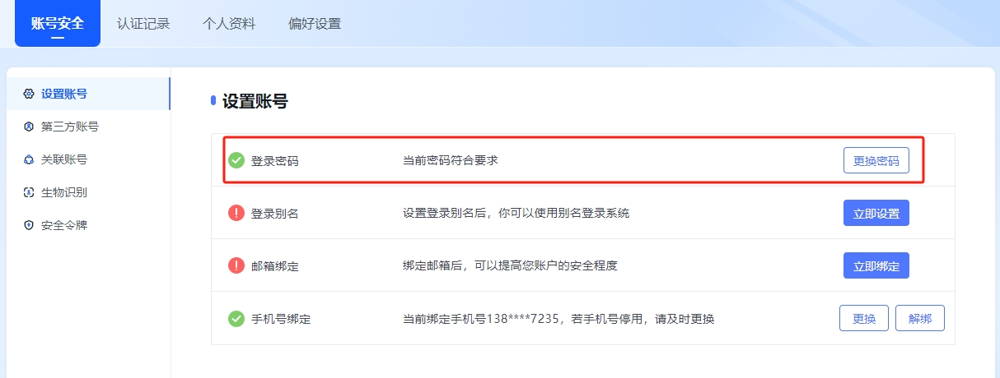

第二种： 打开【北京语言大学】企业号，进入【统一身份认证】应用，底部【账号设置】按钮-【登录密码】，进行密码修改。

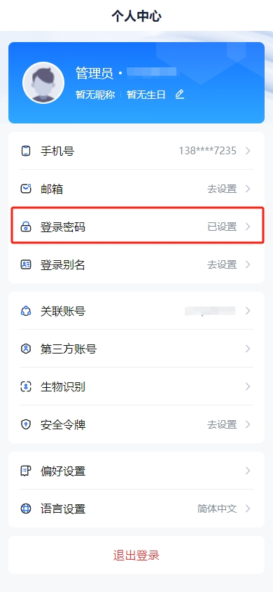

## 统一身份认证有哪些登录方式?

有四种登录方式：

01 扫码登录（微信/企业微信APP）

需关注北京语言大学企业号。详见[微信企业号使用指南](https://mp.weixin.qq.com/s/QytoWYbJWlPA_hefphmu_Q)

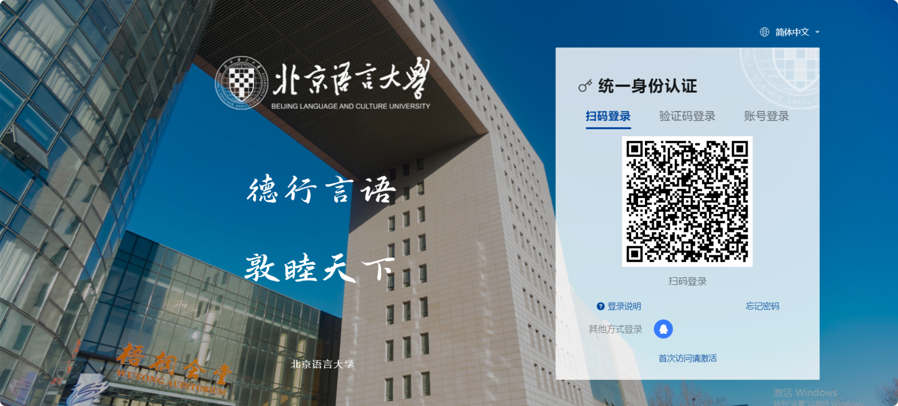

02 验证码登录

在登录页面输入手机号，获取短信验证码，通过校验后即可完成登录。

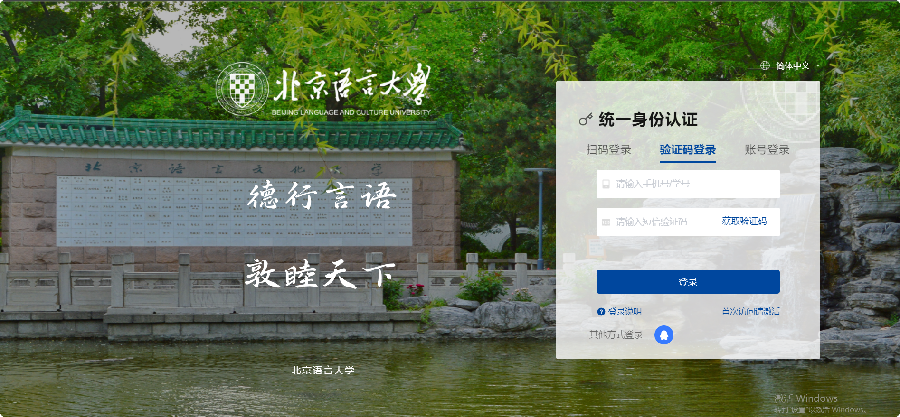

  
维护手机号：

电脑端：登录数字平台，依次点击【右上角头像】—【个人中心】—【账号安全】—【设置账号】—【手机号绑定】；

手机端：打开【北京语言大学企业号】，进入【统一身份认证】应用，点击下方【帐号设置】—【手机号绑定】；

03 账号密码登录

在登录页面输入学号/工号及密码，点击“登录”按钮进行登录。

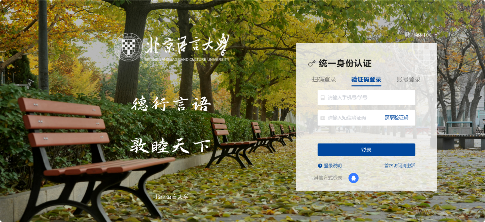

04 QQ登录

点击登录页面 ，用QQ扫描即可完成登录（首次使用需完成QQ账号绑定）。

# 账号激活操作说明

01 校验信息

按照页面提示输入学号/工号、姓名、证件类型、证件号码及页面验证码信息，完成后点击下一步。

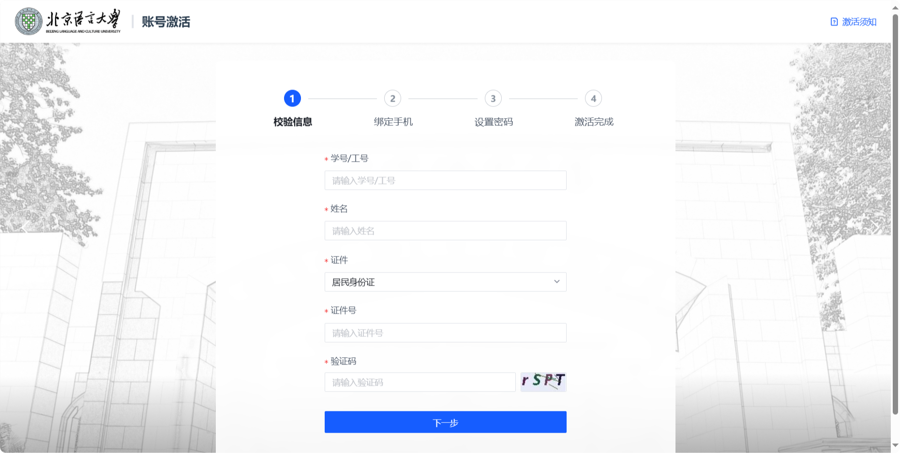

02 绑定手机

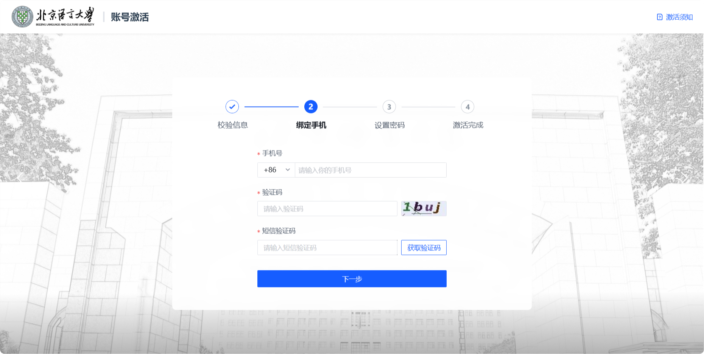

03 设置密码

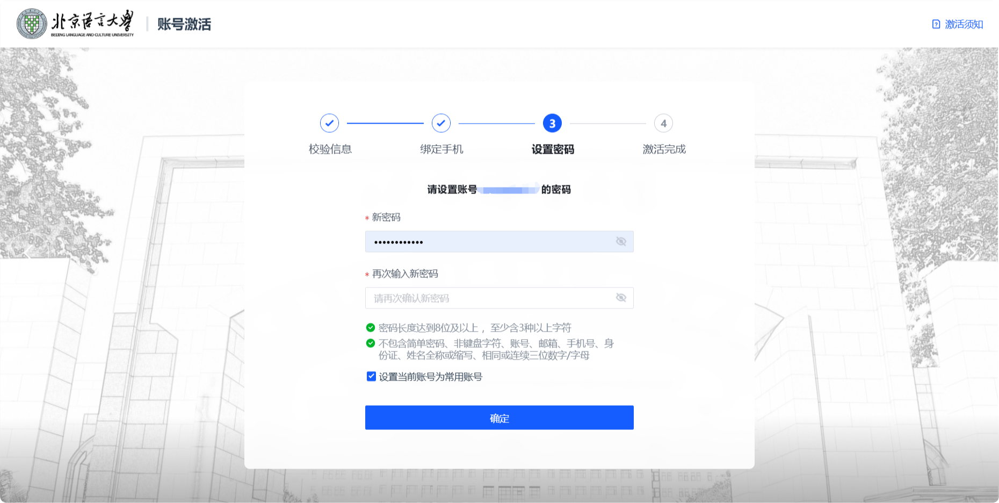

04 关注企业号，激活完成

激活完成，请扫描二维码登录后，完成企业微信关注。后续即可通过微信扫码进行登录。

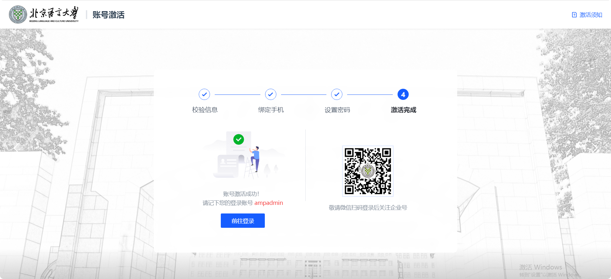

# 密码找回方法

## 密码忘记怎么办?

统一身份认证平台为您提供了三种自助找回密码的方式，供您选择。

01 首先需点击登录界面”忘记密码”按钮

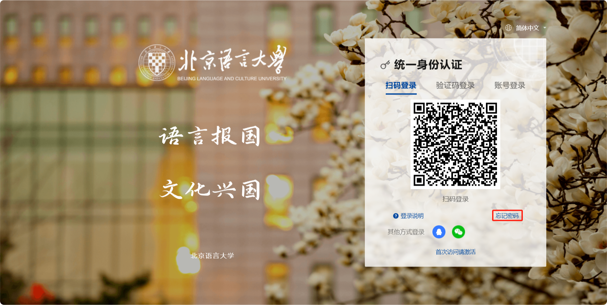

02 按照提示输入学号或工号，填入验证码后点击下一步

会出现以下三种密码找回方式：手机号验证；邮箱验证；企业微信验证

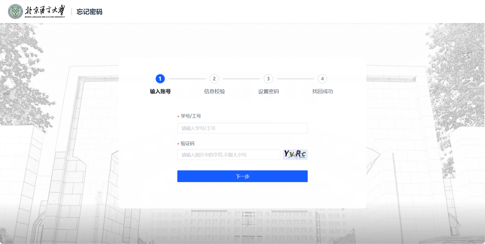

为顺利使用自助方式找回功能，请按照以下步骤完善您的手机号和邮箱信息，并确保已关注企业微信，以便接收找回密码的相关通知及验证信息。

1）绑定：手机号、邮箱

电脑端：登录数字平台，依次点击【右上角头像】—【个人中心】—【账号安全】—【设置账号】—【手机号绑定】、【邮箱绑定】；

手机端：打开【北京语言大学企业号】，进入【统一身份认证】应用，点击下方【帐号设置】—【手机号绑定】、【邮箱绑定】；

2）关注企业微信

需关注北京语言大学企业号。详见[微信企业号使用指南](https://mp.weixin.qq.com/s/QytoWYbJWlPA_hefphmu_Q)